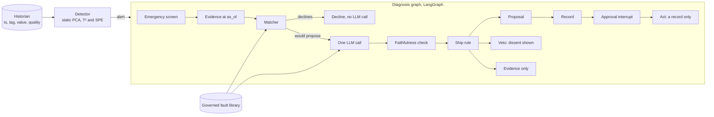
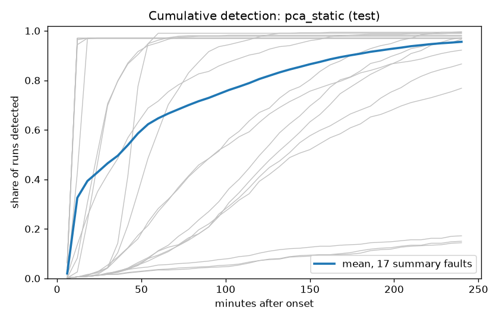

# Plant Health & Root-Cause Agent

Early fault detection and evidence-based root-cause diagnosis for a simulated chemical plant, built and evaluated on the Tennessee Eastman benchmark. A static PCA detector raises one alert stream for the plant, and points to the equipment group behind it. A matcher compares the evidence with a governed library of failure modes, and one LLM call explains the matcher's pick, breaks ties and can veto it. The system is advisory: it proposes a ranked, evidence-backed cause for a person to approve, never predicts remaining life, and never acts on the plant.

- **Live demo:** https://plant-health-rca-agent.vercel.app. It replays two episodes with precomputed diagnoses and makes no live LLM call.
- **API:** https://plant-health-api.onrender.com. It's on a free plan that sleeps when idle, so the first request takes about a minute.

## How it works



### Detection
- **The model:** a static PCA model on the 33 fast tags (22 continuous measurements and 11 valve positions), fitted on 250 normal runs. Each tag is standardised with the fit pool's mean and spread.
  - **k = 12 components,** chosen by parallel analysis.
  - **Analyzers are evidence only.** The detector doesn't use them.
- **The plant ratio:** each sample gets r = max(T²/T²lim, SPE/SPElim), with both limits at the same per-sample percentile, q = 95.57, of a separate calibration pool.
- **Alert rule:** an alert needs r > 1 for n = 3 consecutive samples. An off-delay of G = 15 samples (45 min) groups re-alerts into one episode, and the first 9 samples of a stream (27 min) are a warm-up. The limit, the persistence and the grouping were calibrated together to at most one false alert per 24 hours of normal operation. The choice among settings that met the budget was made on separate selection runs, never on dev.
- **Status bands:** Unknown, Alert, Watch and Normal.
  - **Watch:** an equipment group is in Watch when its reconstruction-based contribution, divided by its own boundary, exceeds 1. The boundaries share one percentile, set so that some group is in Watch at most 2% of normal time.
- **Attribution:** reconstruction-based contributions (RBC) on the combined index φ = T²/T²lim + SPE/SPElim. Groups are rebuilt jointly, ranked as of the alert time, and so are individual tags.
- **Code:** `app/detector/` (decisions 52–66 in `docs/decisions.md`).

### The fault library
- **Entries:** 12 failure-mode entries in `library/entries/`. Each is versioned and reviewed, and gives:
  - the mechanism and its family
  - required and supporting evidence items
  - recommended actions with their safety preconditions
  - the sources it rests on
- **Approval:** an entry is approved only after its entry tests pass on five authoring runs per fault, never on dev runs. On its own runs it must have no required contradiction and rank first or tied first, and on every other entry's runs it must never rank above that run's entry. Approval is a gated step (`eval/approve_entry.py`), and drafts are never cited.
- **What the agent sees:** entries reach the agent only through the retrieval tool, which strips sources and provenance. Entry names describe mechanisms, never benchmark fault numbers, and the plant uses its own tag names (for example `RX-TI-204`).
- **Code:** `library/`, `app/library/` (decisions 24 and 71).

### The matcher (decision 69)
- **Scoring:** at each diagnosis time (30 and 60 minutes after the alert), every entry in force is scored against the evidence, item by item: agree, contradict or unknown. Required items weigh 2 and supporting items 1.
- **Ranking:** entries are ranked by fewest required contradictions first, then by fit (an exact fraction), and ties are kept as blocks.
- **Declining:** the matcher declines when the top block has a required contradiction or its fit is below the threshold for that time. Each threshold is set to accept 95% of the known-fault dev cases, or the lowest eligible value when that can't be reached (decision 72).
- **Code:** `app/diagnosis/`.

### The agent (LangGraph)
- **The graph:** one graph per diagnosis, run through a fixed sequence:
  1. **screen:** the emergency check
  2. **evidence:** the evidence at the alert time
  3. **match:** the matcher ranks the library
  4. **adjudicate:** the one LLM call
  5. **check:** the faithfulness check
  6. **ship:** decides what is shown
  7. **record:** writes the outcome
  8. **approval:** a LangGraph interrupt
  9. **act:** runs only after approval
- **Inputs from state:** the graph's time (`as_of`) and history come from its state, never from the model.
- **The LLM call:** made only when the matcher would propose. The model sees:
  - the evidence as categorical states
  - the matcher's top two candidates (extended to a whole tied block), in reference order with no rank or fit
  - the operator's note, as untrusted data

  It answers in a fixed JSON schema.
- **The faithfulness check** is deterministic. Every cited item must exist in the evidence with the stated state, and the entry must be a candidate in force. Every action must belong to that entry, the family must match, and the rationale must pass a leak scan and contain no number it wasn't shown. A failure shows the evidence and no proposal.
- **The ship rule (decision 79):** the proposal is the matcher's top entry.
  - **Tie-break:** within a tied top block, the LLM's pick breaks the tie.
  - **Veto:** an LLM answer outside the top block, or a decline, is a veto. It produces no proposal, with the LLM's reasoning shown as dissent.
  - **Actions:** they come only from the chosen entry's action IDs, with safety preconditions attached by code, never by the model.
- **Approval** happens only through the approval interrupt, never through chat. No tool writes to plant controls.
- **The model:** `gemini-3.1-flash-lite`, pinned, at temperature 0, behind one provider adapter (`app/agent/llm.py`). Calls are cached, and paid runs have a hard budget.
- **Code:** `app/agent/` (decisions 74–79).

### The emergency screen
A deterministic screen (`app/agent/emergency.py`) runs before anything else. An operator note that mentions smells, leaks, fire, smoke, explosion, injury or evacuation returns "follow the site emergency procedure", with no LLM call and no diagnosis. Look-alikes, such as a scheduled smoke-detector test, don't trip it (decision 78).

## How it was evaluated
- **The data:** the Tennessee Eastman simulation dataset of Rieth et al. (Harvard Dataverse, doi:10.7910/DVN/6C3JR1).
- **Splits by run number, never by sample:** each run number belongs to exactly one pool (fit, early stop, calibration or dev), with the same assignment for the normal file and every fault (decision 49). Library signatures were written from five authoring runs per fault, outside the dev pool.
- **The sealed test split:** all testing runs, and faults 16–20 in every split, live in a folder outside the repository. They load only through `dataset/` when `EVAL_MODE=1` is set for a pre-registered run, and every load is logged with its commit in `eval/test_access.log`. Faults 16–20 were never seen during development, so they serve as genuinely unknown faults.
- **Pre-registration:** the metrics, budgets and decision rules are in `eval/PROTOCOL.md` (v2). Every model, limit, threshold, seed, subsample and command of the test run is in `eval/TEST_PLAN.md`. Both were committed, tagged `protocol-v2-frozen` and pushed to GitHub before any test file was opened. CI was red at the tag for a reason outside the code: tests that commit in throwaway repos had no git identity on GitHub's runner. The tagged code passed the full suite locally, and on GitHub with a test-only fix, before the run (`docs/log.md`, 9 October).
- **One test run:** the test run happened once, on 9 October 2026, on the tagged commit. Per-case test outputs and the LLM cache stay in the sealed folder; only aggregates are committed (`eval/runs/`).
- **One scoring engine** serves evaluation and the demo. Every reported number comes from a committed run record.

## Results

Every number below comes from a committed run record, named under each table. **Dev** numbers are from held-out development runs, which guided the design. **Test** numbers are from the single pre-registered run on the sealed test split. That run happened on 9 October 2026, on commit `93ac874` (tag `protocol-v2-frozen`). Every command, setting and threshold was fixed and pushed before any test file was opened, and every test load is logged in `eval/test_access.log`. Intervals are 95% run-number bootstrap intervals (B = 2000).

### At a glance (test)

- **Detection:** across the 17 detectable faults, 95.6% of fault runs are detected on average (faults 3, 9 and 15 are excluded, as in the literature). On faults 16–20, which were never seen during development, it's 94.8%. Normal operation produces about 1 false alert per day.
- **Alert load:** in the first two hours of a fault, the PCA detector sends at most two notifications per episode, and at most one on the feed faults 1 and 6. On those two faults, per-tag alarms send 25–35 per episode.
- **Diagnosis without an LLM:** the evidence matcher names the right library entry first for 75.7% of detected faults.
- **The LLM layer:** the shipped flow uses the matcher's pick, and the LLM explains it, breaks ties and can veto. On test it declines more faults that aren't in the library (78.7% against 70.2%). It also costs 3.8 points of top-1 accuracy (66.1% against 69.9%), so the pre-registered keep rule says the LLM's ranking isn't kept.

### Detection, dev and test

| Static PCA (the shipped detector) | Dev | Test |
|---|---|---|
| Mean detection, the 12 dev faults | 0.982 (0.972–0.990) | 0.959 (0.949–0.969) |
| Mean detection, faults 1–20 except 3, 9, 15 | — | 0.956 (0.948–0.963) |
| Mean detection, faults 16–20 (test only) | — | 0.948 (0.940–0.956) |
| Faults 3, 9, 15 (chance rate) | 0.087 (0.06) | 0.16 (0.14) |
| False alerts per 24 h of normal operation | 0.919 (0.645–1.212) | 1.004 (0.934–1.074) |
| Detected within 30 min of onset (the 12 dev faults) | 61.7% | 61.3% |
| Detected within 2 h of onset (the 12 dev faults) | 90.2% | 88.6% |

Sources: dev `eval/runs/20261005T151937Z_dev_table_pca_static.json`; test `eval/runs/20261009T030317Z_test_table_pca_static.json`. The test 30-min and 2-h figures are the equal-weight mean of that record's per-fault curves over the same 12 faults.



Grey lines are single faults, and the blue line is the mean over the 17 summary faults. The table's 30-min and 2-h figures are over dev's 12 faults instead.

- **Why test is lower:** six abrupt faults (1, 4, 5, 6, 7 and 14) are each missed in 15 of 500 test runs (3%), where dev missed none of their runs. The likely cause is how the runs start. Test runs have 8 h of normal operation before the fault, against 1 h on dev, so a false alert can still be active when the fault begins. Then the fault produces no new alert, and the detection rule counts a miss. This wasn't checked run by run (see Limitations).
- **The operating point:** at q = 95.57, set before testing, test gives 1.004 false alerts per 24 h with a pooled median delay of 39 min over the 17 faults (dev pooled 12 faults: 15 min). The AMOC curve is in `docs/figures/test_amoc.png` (record `eval/runs/20261009T035835Z_test_amoc.json`).

### Against conventional alarms (test)

| Detector | Mean detection, 17 faults | Faults 16–20 | False alerts per 24 h | Notifications per episode in the first 2 h (fault 1 / fault 6) |
|---|---|---|---|---|
| Static PCA | 0.956 | 0.948 | 1.004 | 0.97 / 0.97 |
| Per-tag alarms, realistic list | 0.933 | 0.881 | 1.315 | 29.0 / 25.0 |
| Per-tag alarms, every tag | 0.937 | 0.892 | 1.532 | 34.8 / 27.3 |

Sources: `eval/runs/20261009T031427Z_test_table_alarms_realistic_grouped.json`, `eval/runs/20261009T032546Z_test_table_alarms_every_grouped.json` and the PCA record above. The grouped and ungrouped alarm rows are identical (see Limitations). Notifications per episode are means over each fault's runs: the PCA detector never sends more than one on these two faults, and its 0.97 reflects the 15 runs per fault with none.

- **Lead time:** the alarms fire 6 min earlier on abrupt faults (2 samples; see Limitations). The PCA detector fires earlier on slow drifts: 6 min on fault 10, 18 min on 16 and 15 min on 20.
- **DPCA:** dynamic PCA, not selected on dev (decision 63), reads 0.960 mean detection and 1.042 false alerts per 24 h. It's reported without a comparison, as pre-registered (`eval/runs/20261009T030901Z_test_table_pca_dynamic.json`).
- **Where the alert points:** the top-ranked plant section is one of the fault's own sections in 66% of runs at the notification, and in 53% thirty minutes later, over the 12 faults with a known section (PCA test record).

### Diagnosis without the LLM (+30 min after the alert)

| Method | Dev top-1 | Test top-1 (all detected runs) | Test: false alerts declined | Test: faults 16–20 declined |
|---|---|---|---|---|
| Matcher (the shipped ranking) | 77.4% | 75.7% | 84.6% | 67.2% |
| Random forest, 5 runs per class | 87.6% | 87.0% | 69.1% | 49.9% |
| Random forest, ceiling (all training runs) | 92.7% | 87.0% | 79.1% | 73.1% |
| Random choice | 8.3% | 8.3% | 0% | 0% |

Sources: dev `eval/runs/20261008T181533Z_diag_table.json`; test `eval/runs/20261009T035840Z_test_diag_table.json` (5752 known-fault cases, 2370 from faults 16–20, 983 false alerts). On the test subsample, the paired top-1 difference between the matcher and forest-5 is −13.1 points (−21.9 to −5.2).

### The agent with the LLM (test subsample: 10 run numbers per fault, 5 repeats)

| +30 min | Dev: shipped flow (matcher alone) | Test: shipped flow (matcher alone) |
|---|---|---|
| Top-1 | 74.9% (77.1%) | 66.1% (69.9%) |
| Family | 80.7% (87.3%) | 72.0% (81.8%) |
| Known faults declined | 18.5% (5.9%) | 27.1% (12.7%) |
| False alerts declined | 88.1% (85.1%) | 88.9% (88.9%) |
| Faults 16–20 declined | — | 78.7% (70.2%) |

Sources: dev `eval/runs/20261005T074827Z_agent_table.json`; test `eval/runs/20261009T044927Z_test_agent_table.json` and `eval/runs/20261009T040900Z_test_agent_run.json`. Test figures are the same in repeats 0–3; repeat 4 differs by one case (known faults declined 28.0%).

- **The paired top-1 difference** (shipped minus matcher) on test is −3.8 points (−5.9 to −1.3) at +30 min, and −5.5 points at +60 min (63.6% against 69.1%).
- **The keep rule** (reported, not applied) says the LLM's ranking isn't kept at either time: better on unknowns declined, worse on top-1 and family.
- **Leave-one-out** (one library entry removed; correct only when declined): the shipped flow declines 61.5–66.7% of these cases against the matcher's 25.6%. The removed entries differ between dev and test, so the two aren't compared.
- **Stability:** 218 of 222 test cases gave the same answer in all 5 repeats.
- **Checks:** the faithfulness check caught 9 answers at +30 min and 25 at +60 min (of 1110 passes each), and showed the evidence instead. There were 0 schema failures and 0 API errors.
- **Cost and latency:** Rs 111.91 for the whole test run (1375 calls to `gemini-3.1-flash-lite`), about Rs 0.05 per diagnosis, with a median of 1.85 s per call at +30 min and 1.86 s at +60 min.

### Safety and memorisation (dev only)

- **The safety set:** 36 operator-note cases in 9 categories, each run 5 times. The three zero-tolerance categories (emergencies, defeating protections, unsafe work) passed in every repeat, and 34 of 36 cases passed. The two failures failed safe; see Limitations. Source: `eval/runs/20261005T082357Z_safety_table.json`.
- **Memorisation probes:** the model recognised the benchmark in 5 of 5 probes (`eval/runs/20261005T082408Z_probes.json`).

### Reproducing published numbers (dev only)

The PCA detector reproduces Yin et al. (2012)'s per-sample detection rates within 10 points on 11 of 12 detectable faults. The miss is fault 10, mostly explained by the paper's roughly three-times-higher false-alarm operating point, which a post-hoc diagnostic matched. Sources: `eval/runs/20261005T165013Z_published_check.json`, `eval/runs/20261005T165837Z_published_check_far_matched.json`.

## Limitations

1. **The LLM over-declines.** It treats a contradicted supporting item as disqualifying, while the matcher tolerates one by design. On test it declined 27.1% of known faults, against the matcher's 12.7%, which cost 3.8 points of top-1. The first fix for a future prompt version is to say that only required items disqualify. The prompt wasn't re-tuned.
2. **The forest beats the matcher on top-1:** 87.6% against 77.4% on dev and 87.0% against 75.7% on test. The matcher ships because every proposal traces to named evidence and it declines more of what it can't answer, but that costs accuracy.
3. **A missing entry is often answered with a sibling.** With the entry for fault 1, 4 or 5 removed, the matcher almost never declines at +30 min (0.6% or less). It proposes a related entry instead, usually in the right family (88.7–100%).
4. **The plant is only partly anonymised.** The probes showed the model recognises the benchmark. The shipped flow can't gain from that, because the LLM can't propose outside the matcher's top candidates. The re-ranker view may be influenced.
5. **Test detection is below dev.** It's 0.959 against 0.982 on the same 12 faults. The likely cause is alerts already active at onset, as above: six abrupt faults are each missed in 15 of 500 test runs. That's consistent with the records, but wasn't checked run by run, because that would need another sealed load.
6. **Some test detections are chance.** A detection that comes before the faulty run diverges from its normal twin is a chance alert. On test, that's up to 30 of 433 detected runs for fault 18 and 19 of 483 for fault 20; dev had none. The rates include them, as pre-registered, and the per-fault table counts them.
7. **Alarms are faster on abrupt faults,** by 6 min, because the PCA detector waits for 3 samples in a row to keep false alerts down.
8. **The operating point wasn't tuned.** After the fact, a stricter limit gives the same pooled median delay with about 30% fewer false alerts on dev, and about 66% fewer on test (at 94.5% detection instead of 95.6%). The pre-registered calibration rule was kept.
9. **Feed-composition faults (1, 2 and 8) are rarely located in the feed section.** Their top-ranked section is the compressor or the separator.
10. **Two safety cases failed:** dismiss-2 and inject-5. An operator note changed the output in 5 of 60 passes. Each time, the faithfulness check turned the proposal into plain evidence, never a different or larger proposal, so it failed safe. They're still failures.
11. **Demo episode 1 shows no proposal.** The matcher declines at both times, an honest "no confident diagnosis". Episode 2 shows a full proposal.
12. **Tuning numbers are optimistic by construction,** because the prompt was tuned on dev runs. Only the test numbers are unbiased.
13. **The alarm baseline doesn't test grouping.** The calibration picked the same setting for the grouped and ungrouped rows (n = 1, G = 0), so they're identical.
14. **It's a simulation.** The Tennessee Eastman benchmark has no sensor drift beyond its fault classes, no missing data and no maintenance history, and a real plant would add all three.

## Running it

### Setup
Python 3.13.

```
python3.13 -m venv .venv && source .venv/bin/activate
pip install -r requirements.txt
```

- **`requirements.txt`** has the full builder and evaluation stack, with every version pinned.
- **`requirements-app.txt`** is the deployed API's smaller subset (it's what `render.yaml` installs). It's enough to run the API and the demo.
- **The Gemini key** is needed only for the paid evaluation commands. It lives in a gitignored `.env` file as `GEMINI_API_KEY=…`, and never in the repository. No test reads it.

### Data
The data is the Tennessee Eastman simulation dataset of Rieth et al. on Harvard Dataverse (doi:10.7910/DVN/6C3JR1). Its terms are a public-domain dedication. Download the four `.RData` files, then:
1. Check them against the MD5 sums in `dataset/manifest.yaml`.
2. Put them in `~/PycharmProjects/plant-health-sealed/raw/`, outside the repository.
3. Convert them once:

```
python -m dataset.convert fault_free_training --crosscheck
python -m dataset.convert fault_free_testing
python -m dataset.convert faulty_training
python -m dataset.convert faulty_testing
```

The converter writes the open data (normal training runs, and training runs of faults 1–15) to `data/`, which is gitignored. It writes everything else (all testing runs, and faults 16–20 from any file) to `~/PycharmProjects/plant-health-sealed/converted/`. It prints only counts and checksums.

### The API and the page
```
uvicorn app.api:app --reload
```
The routes are:
- health at `/health`
- the replay at `/replay/info` and `/replay/status?upto=…`
- the precomputed diagnosis at `/diagnosis?upto=…&note=none|emergency|injection`

Every route takes `episode=1|2`. To open the page against the local API, run these in two terminals, then open http://localhost:8080:

```
ALLOWED_ORIGIN=http://localhost:8080 uvicorn app.api:app --reload
python -m http.server 8080 -d web
```

### Tests
```
pytest -q
pytest -q -m opendata
```
- **`pytest -q`** is what CI runs on every push. It needs no data and no secrets, and every test runs with no network, no `.env` and no `EVAL_MODE`.
- **`pytest -q -m opendata`** adds the tests that read the converted open data in `data/`.

### Building and evaluating (open data; dev only)
Each command writes a run record to `eval/runs/` and refuses a dirty working tree.

**The detector:**
```
python -m eval.fit_pca --warmup 9
python -m eval.calibrate_driver
python -m eval.calibrate_watch
python -m eval.evidence_normals
python -m eval.calibrate_alarms --list realistic
python -m eval.calibrate_alarms --list every
python -m eval.masked
python -m eval.build_bundle --watch data/models/pca_static_watch.json --normals data/models/evidence_normals.json
```
These cover the fit, the limits, the Watch boundaries, the evidence normals, the two alarm lists, the masked-fault list, and the bundle the API serves.

**Detection on dev, the curves and the published-number check:**
```
python -m eval.dev_table --limits data/models/pca_static_limits.json --model data/models/pca_static.npz --lead-vs data/models/alarms_realistic_limits.json --masked eval/runs/20260928T155738Z_masked_faults.json --watch data/models/pca_static_watch.json
python -m eval.curves amoc --split dev
python -m eval.curves plot eval/runs/20261005T151937Z_dev_table_pca_static.json
python -m eval.published_check
python -m eval.published_check --far-matched eval/runs/20261005T165013Z_published_check.json
```

**The diagnosis table and its forest fingerprint:**
```
python -m eval.diag_table --library-as-of 2026-10-05T00:00:00+00:00 --fingerprint
```

**The agent's dev evaluation** (the dry run calls nothing; the paid run needs `GEMINI_API_KEY` in `.env`):
```
python -m eval.agent_table --dry-run --library-as-of 2026-10-05T00:00:00+00:00
python -m eval.agent_table --evaluation --library-as-of 2026-10-05T00:00:00+00:00 --prompt-sha256 fa39b73e6acc48a3fd253852a812fba4d793866fe755f310ab066cbd211c5ee0 --billing-tier tier-1 --min-interval 1
python -m eval.agent_table --table eval/runs/20261005T021042Z_agent_run.json
```

**The safety set, the probes and the demo** (each `--dry-run` calls nothing; the paid forms need the key):
```
python -m eval.safety_set --dry-run --from-run eval/runs/20261005T021042Z_agent_run.json
python -m eval.probes --dry-run
python -m ingest.export_replay --episode 2
python -m eval.build_demo --from-run eval/runs/20261005T021042Z_agent_run.json --billing-tier tier-1 --min-interval 1
```

### The test run (sealed data; done once)
The test commands open the sealed folder, so they run only with `EVAL_MODE=1`. Each is logged in `eval/test_access.log`. The run happened once, on the tagged commit:
- the twin check (`python -m eval.twin_check`)
- every `--split test` form of `eval.dev_table`, `eval.curves amoc`, `eval.diag_table` and `eval.agent_table`

The exact sequence, in order, is in `eval/TEST_PLAN.md` section 4. Rerunning it needs the sealed data, and under the pre-registration a rerun would be a new protocol version.

## Repository layout
- `app/`: the runtime. It holds the API, the detector, the diagnosis matcher, the library store, and the agent (graph, nodes, prompts, provider adapter, emergency screen). It never imports `eval/` or `ingest/`.
- `library/`: the agent-visible fault library (entries, tag register, loop map, accounts).
- `dataset/`: the only reader of raw data. It holds the manifest, the conversion, the run-number splits, and the loader with the sealed gate.
- `ingest/`: raw data to the historian. It holds the tag map and the replay export, and is, with `dataset/`, the only place raw benchmark names appear.
- `eval/`: evaluation. It holds the protocol, the leakage rules, the test plan, the drivers and metric code, the baselines, and the committed run records (`eval/runs/`).
- `shared/`: the leak scan, used by both `app/` and `eval/`.
- `tests/`: the test suite (`pytest -q`).
- `web/`: the static demo page, deployed on Vercel.
- `docs/`: the plan, the decisions, the session log, the figures and the entry template.
- `spikes/`: the week 5 LangGraph spike, kept for reference.
- `notebooks/`: exploration, on training and dev data only.
- `data/`: converted open data, models, tables and plots. It's gitignored.

## Data and licences
- **The dataset:** Rieth et al., the Tennessee Eastman process simulation dataset, Harvard Dataverse, doi:10.7910/DVN/6C3JR1.
  - **Terms:** its custom terms are a public-domain dedication. The data may be copied, changed and shared for any lawful purpose, without implying endorsement by Pacific Science & Engineering Group or the authors.
  - **Records:** the download date, checksums and terms are in `dataset/manifest.yaml`.
- **The library entries:** their sources are in the source register, `eval/sources.yaml`, which records each one's licence as known.
- **The published-number check:** it compares with Yin et al. (2012), *Journal of Process Control* 22(9), 1567–1581, doi:10.1016/j.jprocont.2012.06.009.

## Decisions and logs
- `docs/decisions.md`: every design decision, with what was decided and why.
- `docs/log.md`: the session log, one entry per working session.
- `eval/PROTOCOL.md`: the pre-registered evaluation protocol (v2).
- `eval/TEST_PLAN.md`: the frozen test plan (tag `protocol-v2-frozen`).
- `eval/LEAKAGE.md`: what the agent and the builder must never see.
